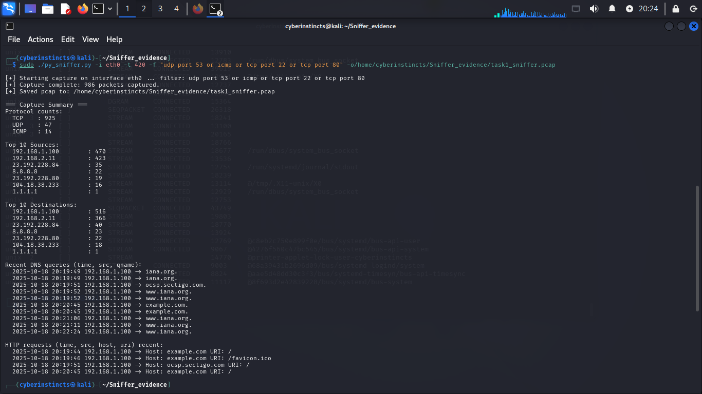
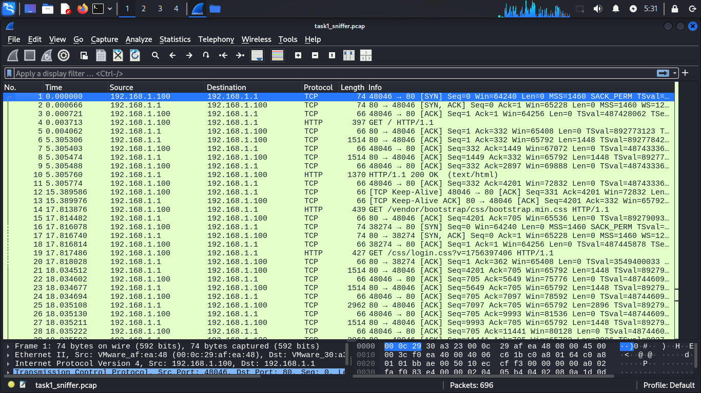

# Basic Network Sniffer

## Objective
To build and run a simple Python based network sniffer that captures and analyzes packets, to understand network data flow and common protocols.

## Tools Used 
- Kali Linux (VMware)
- Windows 10 (Vmware) - as a remote host generating network activity.
- Scapy (for packet sniffing and decoding)
- Python 3
- Wireshark (to display captured traffic )

## Implementation Steps ##
1. **Prerequisites**: 
    - Python 3.x
    - Administrator/root access to run the script, as raw sockets require elevated permissions.

2. **Setup**:
   - Created working directory on Kali:
     ```bash
     mkdir Sniffer_evidence
     ```
   - Navigate to the directory:
     ```bash
     cd Sniffer_evidence
     ```

3. **Run the script**:
   - Clone the repository or download the script:
     ```bash
     git clone (Basic-Network-Sniffer/py_sniffer.py)
     ```
   - Filters were added to capture common protocols
   - You may also need to run the script with elevated privileges to use raw sockets:
     ```bash
     sudo python3 py_sniffer.py "udp port 53 or icmp or tcp port 80 or tcp port 22"
     ```
## Output




## Usage
- The script listens for incoming Ethernet frames and prints information such as MAC addresses, Ethernet protocol, and IPv4 packet details.
- To start sniffing, simply run the script as mentioned above. It will run in an infinite loop and output packet details as they are captured.
- Subsequently, the windows VM was used to generate traffic by trigerring ping, tracert, and ssh commands which generated ICMP + TCP traffic.
- Packets were saved and opened on wireshark for a more appreciated visual display.

## Analysis of Captured Packets
By analyzing these fields, we observed how data flows from one host to another and how different protocols encapsulate their information.

- Source / Destination: IP addresses of the communicating hosts (Windows ↔ Kali).
- Protocol: Determines the communication type (ICMP, TCP, UDP).
- Payload: The actual content carried in the packet (for example HTTP GET requests or command data).

## Conclusion

- Learnt the structure of network packets (Ethernet → IP → TCP/UDP → Data).
- Observed live communication patterns between two VMs.
- Identified how filters isolate specific traffic types.


