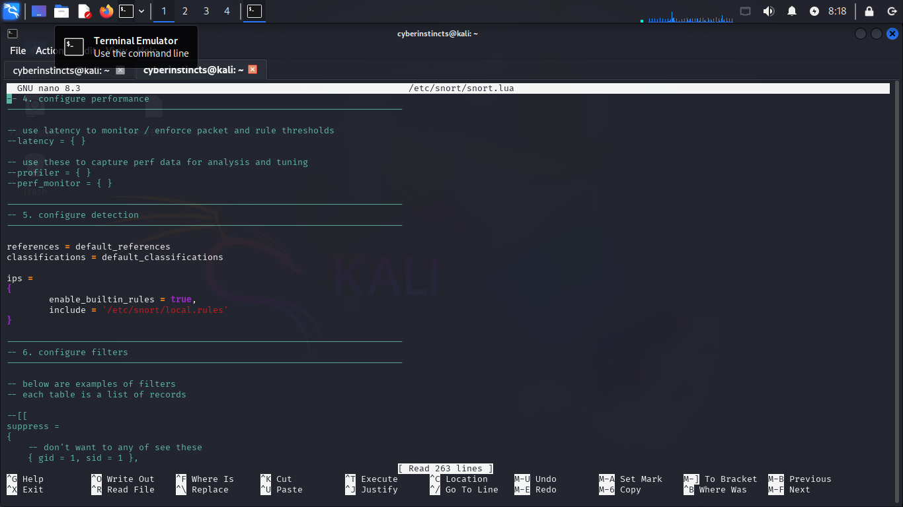

# Network Intrusion Detection System

## Objective
This task focused on configuring **Snort**, a popular open source Intrusion Detection System (IDS) to **monitor network traffic**, **detect malicious activity** and **log alerts for analysis**. 

## Tools Used 
- Kali Linux (VMware)
- Snort 3 IDS
- Windows 10 VM (for attack simulation)
- Python 3 + Matplotlib (for log visualization)
- Nmap

## Implementation Steps ##
1. **Prerequisites**: 
   - Snort (latest version)
   - libpcap (for packet capture)
   - DAQ (Data Acquisition library)
   - Support libraries (e.g., pcre, libdnet)

2. **Setup**:
   - Installed Snort 3 on Kali:
     ```bash
     sudo apt install snort
     ```
   - Edited Local Rule File:
     ```bash
     sudo nano /etc/snort/local.rules
     ```
   - Added Custom Rules:
     ```bash
     alert icmp any any -> any any (msg:"ICMP Ping Detected"; sid:1000001;)
     alert icmp any any -> any any (msg:"Large Ping Packet Detected"; dsize:>1000; sid:1000004;)
     alert tcp any any -> any 22 (msg:"SSH Connection Detected"; sid:1000002;)
     alert tcp any any -> any 3389 (msg:"RDP Attempt Detected"; sid:1000003;)
     alert tcp any any -> any any (msg:"Port Scan Detected"; flags:S; threshold:type both, track by_src, count 30, seconds 10; sid:1000005;)
     ```

3. **Snort Configuration**:
   - Snort configuration file was edited using:
     ```bash
     nano etc/snort/snort.lua
     ```
   - The edited local rule file was added in the Snort's configure detection section:
     ```bash
     ips = {
     include = "/etc/snort/local.rules"
     }
     ```
     This ensured Snort loads the custom rules in addition to its built-in signatures, enabling detection of activities we wanted to monitor during testing.

   - Output logging was also configured in Snort's configure output section:
     ```bash
     alert_fast = { file = true, limit = 50 }
     ```
   This ensured that Snort logs alerts for later analysis to:
     ```bash
     /var/log/snort/alert_fast.txt
   
4. **Running Snort**:
   - Snort was launched in IDS mode using:
     ```bash
     sudo snort -A fast -c /etc/snort/snort.lua -i etho
     ```
   - Alerts where triggered through traffic generated from Windows Vm to the Kali Snort System with actions such as ssh, ping, RDP, and port scan.

5. **Logs Verification & Conversion**:
   - Logs were verified using:
     ```bash
     sudo tail -f /var/log/snort/alert_fast.txt
     ```
   - and converted to csv for visualization using:
     ```bash
     cat /var/log/snort/alert_fast.txt | tr -s ' ' ',' > snort_alerts.csv
     ```

6. **Visualization**:
   - A python script was run to analyze and visualize the frequency of detected protocols
   - Clone the repository or download the script:
     ```bash
     git clone (Network Intrusion Deection/snort_visualize.py)
     ```

## Output



## Observation
   - Snort detected ICMP, TCP and ARP corresponding to ping, SSH and scan activity
   - The events were logged in real time and exported for analysis

## Conclusion
   - This project demonstrated the process of setting up an IDS using Snort, writing custom detection rules, and visualizing logged events.
   - It showed the importance of continous traffic monitoring and post-incident analysis as part of modern network defense.
